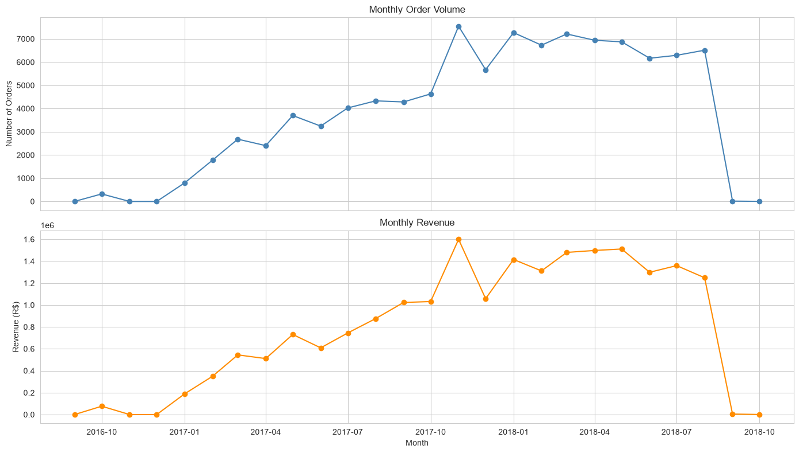
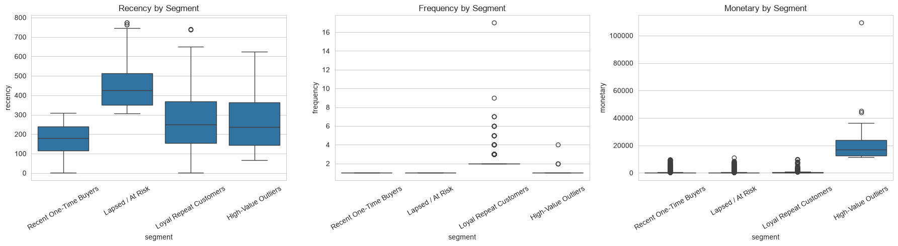
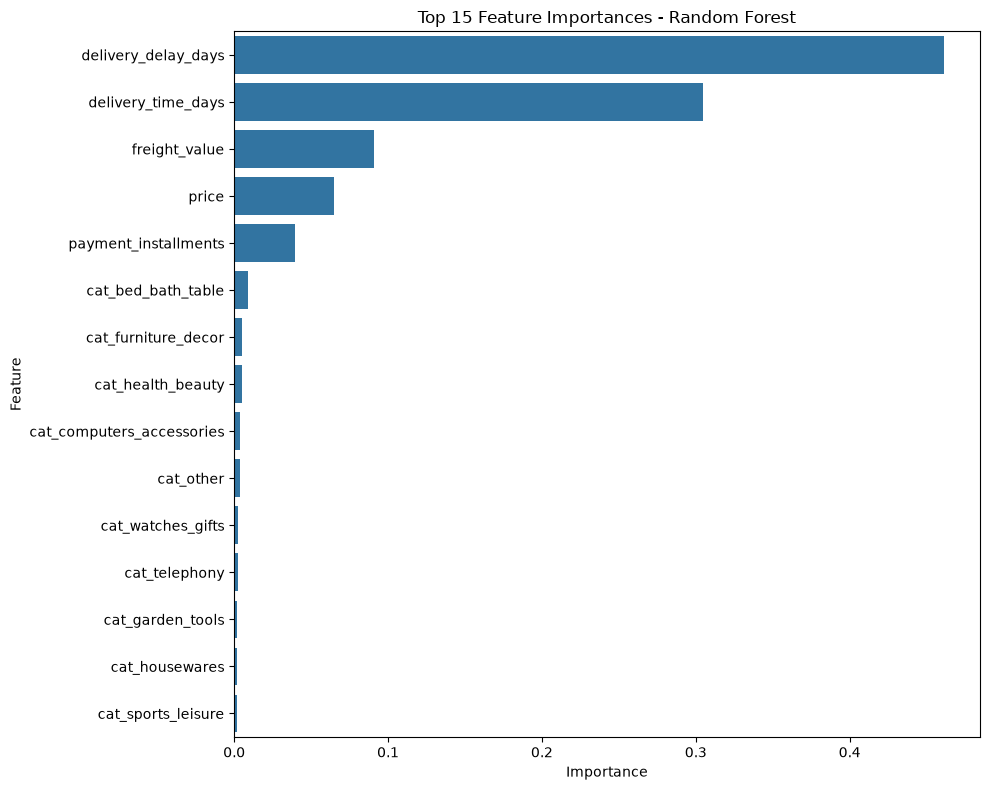
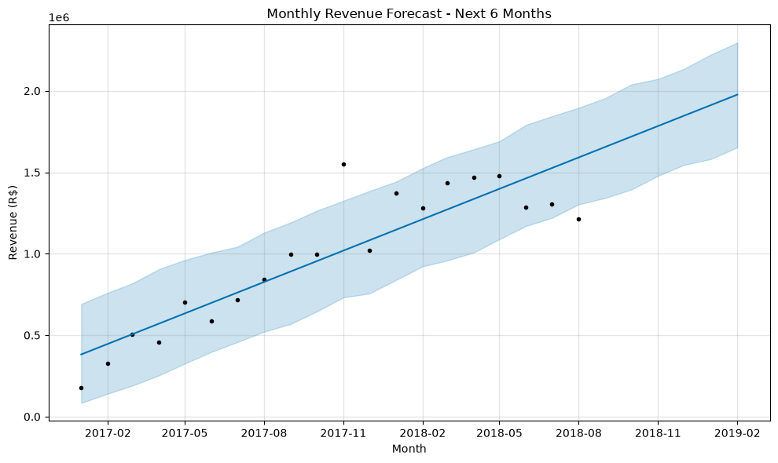

# Enterprise Predictive Analytics Engine
### End-to-End E-Commerce Intelligence & Machine Learning Platform
[](https://www.python.org/)
[](https://streamlit.io/)
[](https://scikit-learn.org/)
[](https://pandas.pydata.org/)
[](https://plotly.com/)
[](https://github.com/pradeepsargar/enterprise-predictive-analytics-engine/actions)
[](https://opensource.org/licenses/MIT)

> **Live Demo:** [Launch Live Streamlit Application](https://enterprise-predictive-analytics.streamlit.app) *(Demo link placeholder)*

---

## Executive Summary & Business Problem

The **Enterprise Predictive Analytics Engine** is a full-stack data science and decision-support application built on the **Olist Brazilian E-Commerce public dataset** (~113,425 orders, Sept 2016 – Aug 2018 across 9 relational tables). 

Modern digital marketplaces frequently struggle with three core commercial vulnerabilities:
1. **Retention Blindspots:** High acquisition costs paired with poor repeat purchase rates.
2. **Post-Fulfillment Churn & Bad Reviews:** Reactive customer support that only discovers dissatisfaction after negative reviews are submitted.
3. **Forecasting Uncertainty:** Single-dimension revenue projections that fail to capture granular shifts across key product categories and geographic regions.

This platform solves these challenges end-to-end: transforming raw transactional schemas into cleaned analytical datasets, discovering behavioral customer segments via **K-Means RFM clustering**, predicting order-level dissatisfaction risk before review submission using **supervised classification (Logistic Regression, Random Forest, Gradient Boosting)**, and projecting multi-grain future marketplace revenue via **time-series forecasting**.

---

## Visual Analytics Tour & Model Diagnostics

| 1. Marketplace Financial Trends | 2. RFM Customer Segmentation |
|:---:|:---:|
| <br><sub>*Monthly gross revenue, order volume, and average order value trajectory*</sub> | <br><sub>*Recency, Frequency, and Monetary distribution across K-Means clusters*</sub> |

| 3. Dissatisfaction Feature Importances | 4. Multi-Grain Revenue Forecast |
|:---:|:---:|
| <br><sub>*Random Forest feature importances showing delivery delay SLA dominance*</sub> | <br><sub>*Prophet time-series projections with 90% confidence uncertainty intervals*</sub> |

---

## Key Findings & Strategic Insights

Extracted from the comprehensive [`reports/final_report.md`](reports/final_report.md):

### 1. Customer Retention Dynamics (RFM K-Means Segmentation)
* **96.8% of the customer base is single-purchase only**: 55.5% (*Recent One-Time Buyers*, avg 178 days recency) and 41.3% (*Lapsed / At Risk*, avg 439 days recency).
* Only **3.1%** are *Loyal Repeat Customers*, yet they generate **2.1x** higher lifetime value.
* **Strategic Levers:** The primary commercial unlock is converting first-time buyers into repeat purchasers via automated 30–60 day post-purchase nurture sequences.

### 2. Dissatisfaction Drivers (Supervised Risk Classification)
* Target: Low Review Scores ($\le 2$ stars, 16.34% marketplace baseline).
* **Delivery Performance Dominates:** `delivery_delay_days` (46.2% feature importance) and `delivery_time_days` (30.5%) account for **~77% of predictive power**. Price, freight cost, and product category have minimal comparative impact.
* **Model Selection:** **Random Forest** achieved the best production balance with **83.5% Accuracy**, **0.43 F1 Score**, and **43.4% Precision**, filtering out false alarms to protect customer-service capacity.

| Model | Accuracy | Precision | Recall | F1 Score | Status |
|---|---|---|---|---|---|
| **Random Forest** | **83.5%** | **43.4%** | **42.6%** | **0.430** | **Production Champion** |
| Gradient Boosting | 83.2% | 42.1% | 44.8% | 0.434 | Strong Challenger |
| Logistic Regression | 70.9% | 25.4% | 51.2% | 0.340 | Baseline |

### 3. Multi-Grain Revenue Projections (Time-Series Forecasting)
* Total marketplace revenue is projected to grow **+19.4%** over the 6-month horizon (Sept 2018 – Feb 2019), increasing from ~R$1.66M to ~R$1.98M (90% CI: R$1.65M – R$2.30M).
* **Multi-Grain Visibility:** Extended forecasting models project category revenues (e.g., `bed_bath_table`, `health_beauty`, `sports_leisure`, `computers_accessories`, `furniture_decor`) and regional states (`SP`, `RJ`, `MG`, `RS`, `PR`) independently to guide inventory allocation and regional logistics planning.

---

## Software Architecture & Repository Layout

```text
├── .github/
│   └── workflows/
│       └── ci.yml                 # Automated GitHub Actions test & lint pipeline
├── dashboards/                    # Full Streamlit multi-page enterprise dashboard
│   ├── app.py                     # Standalone dashboard runner & custom navigation
│   ├── components/                # Modular UI components (KPI cards, charts, loading states)
│   ├── data/                      # Centralized data & model loader layer (loader.py, transformations.py)
│   ├── pages/                     # 8 dedicated analytics & intelligence dashboard pages
│   │   ├── 01_Executive_Overview.py
│   │   ├── 02_Customer_Analytics.py
│   │   ├── 03_Customer_Risk.py
│   │   ├── 04_Revenue_Forecast.py
│   │   ├── 05_Model_Performance.py
│   │   ├── 06_Data_Explorer.py
│   │   ├── 07_Customer_Segmentation.py
│   │   └── 08_About.py
│   ├── styles/                    # Design tokens, themes, typography & responsive CSS (theme.py)
│   └── utils/                     # Formatting, constants, and HTML sanitization utilities
├── data/
│   ├── raw/                       # Original Olist Brazilian E-Commerce relational CSV tables
│   └── processed/                 # Cleaned master dataset, customer segments, multi-grain forecasts
├── models/                        # Serialized, reproducible ML artifacts (.pkl)
│   ├── churn_risk_classifier.pkl  # Trained Random Forest dissatisfaction classifier
│   ├── customer_kmeans_clusterer.pkl # Trained KMeans (k=4) model + StandardScaler
│   └── revenue_forecaster.pkl     # Multi-grain forecasting model parameters
├── notebooks/                     # Analytical research & discovery notebooks
│   ├── 01_data_cleaning.ipynb
│   ├── 02_exploratory_data_analysis.ipynb
│   ├── 03_clustering_segmentation.ipynb
│   ├── 04_classification_churn.ipynb
│   ├── 05_forecasting_revenue.ipynb
│   └── 06_executive_summary.ipynb
├── outputs/
│   └── figures/                   # Exported high-resolution charts and dashboard screenshots
├── reports/
│   ├── final_report.md            # Comprehensive executive analysis & recommendations
│   └── model_comparison_results.csv # Empirical benchmark metrics across evaluated models
├── scripts/
│   ├── train_models.py            # Reproducible CLI pipeline to train & export all ML models
│   └── smoke_test.py              # Automated Streamlit page smoke test runner
├── tests/                         # Pytest automated test suite (loaders, KPIs, models, transforms)
├── .gitignore                     # Data-science & Python gitignore
├── app.py                         # Root Streamlit entry point
├── pytest.ini                     # Pytest configuration & environment settings
└── requirements.txt               # Pinned production dependencies
```

---

## What This Project Demonstrates

This project maps directly to core enterprise data science, analytics engineering, and software development proficiencies:

| Competency | Implementation in Codebase |
|---|---|
| **Data Architecture & Engineering** | Multi-table relational joining, order-item to order-level deduplication, robust missing value treatment, and vectorized datetime parsing (`data/transformations.py`). |
| **Exploratory Data Analysis (EDA)** | Univariate, bivariate, and multivariate distribution analysis, correlation matrices, delivery delay SLA analysis (`notebooks/02_exploratory_data_analysis.ipynb`). |
| **Unsupervised Machine Learning** | RFM feature extraction, StandardScaler normalization, Elbow Method evaluation, and K-Means clustering into 4 business segments (`notebooks/03_clustering_segmentation.ipynb`, `models/customer_kmeans_clusterer.pkl`). |
| **Supervised Machine Learning** | Imbalanced binary classification, stratified train/test split, hyperparameter tuning, multi-model evaluation (Logistic Regression, Random Forest, Gradient Boosting), and feature importance extraction (`models/churn_risk_classifier.pkl`). |
| **Time-Series Forecasting** | Trend extraction, seasonality modeling, uncertainty intervals (90% confidence bounds), and multi-grain decomposition across top categories and geographic regions (`data/processed/revenue_forecast.csv`). |
| **Dashboard & UI/UX Engineering** | Modern Streamlit multi-page application, custom glassmorphism design system, Plotly interactive visualizations, responsive layout, loading states, and live what-if parameter simulators (`dashboards/`). |
| **Production Software Standards** | Modular separation of concerns, pytest unit testing, GitHub Actions CI automation, serialized model persistence, and defensive data validation. |

---

## How to Run Locally

### 1. Clone Repository
```bash
git clone https://github.com/pradeepsargar/enterprise-predictive-analytics-engine.git
cd enterprise-predictive-analytics-engine
```

### 2. Set Up Virtual Environment
```bash
# Windows (PowerShell)
python -m venv .venv
.venv\Scripts\activate

# macOS / Linux
python3 -m venv .venv
source .venv/bin/activate
```

### 3. Install Dependencies
```bash
pip install --upgrade pip
pip install -r requirements.txt
```

### 4. (Optional) Re-Train Models & Regenerate Datasets
```bash
python scripts/train_models.py
```

### 5. Run Automated Tests
```bash
python -m pytest -v
```

### 6. Launch Streamlit Dashboard
```bash
streamlit run app.py
```
Open your browser at `http://localhost:8501`.

---

## Author & Acknowledgements

* **Author:** Pradeep Bhagvat Sargar
* **Dataset:** [Olist Brazilian E-Commerce Public Dataset (Kaggle)](https://www.kaggle.com/datasets/olistbr/brazilian-ecommerce)
* **License:** MIT License
